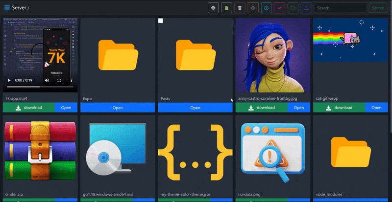

# 📦 Xplora-File Server

XFS is light weight file server, mainly for home networks where you don't required password login. XFS allow you to access, create, upload, rename & delete your files & folder.

## Running

Run `setup.sh` script in terminal.

```
$ setup.sh
```

## Settings

change these setting according to your requirements in
`php.ini` settings

Maximum allowed size for uploaded files.

```
upload_max_filesize=20M
```

Maximum size of POST data that PHP will accept.

```
post_max_size=20M
```

> **Note:** Make `upload_max_filesize` and `post_max_size` same.

Maximum number of files that can be uploaded via a single request

```
max_file_uploads=100
```

### Nginx Setting Settings

If you are using nginx, make these changes for uploading larger files.

```
server {
    #...
    client_max_body_size 100M;
}
```

## File structure

File structure after running setup script.

```
root (htdocs)
├── index.php
├── .htaccess
└── xplora-file-server
    ├── .github
    ├── assets
    ├── data
    ├── php
    ├── scripts
    ├── styles
    ├── vendor
    ├── .gitignore
    ├── .htaccess
    ├── 404.php
    ├── setup.sh
    ├── logo.png
    ├── favicon.ico
    ├── README.md
    └── index.php
```

## Preview



### Thank You! 🙏
